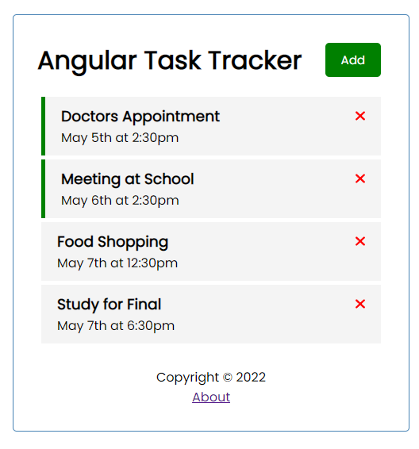
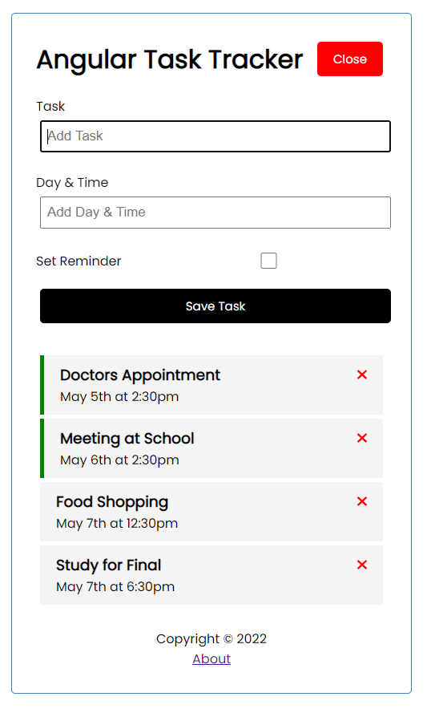

# Angular-Task-List

I wanted to start the summer off strong with an Angular refresher course. Because of that, I built a Task/To-do list!

## How does it work?

It uses *Angular.js* and reads/writes to a database (or should a say a fake one) AKA `db.json` using the node package, [json-server](https://www.npmjs.com/package/json-server).

Tasks can be created or deleted from the database via the front end.

Additional functionality also includes:
- Double clicking a Task card to enable a "reminder" (left hand sign turns green).

## How can I demo this project?

1. Clone the repository.
2. Make sure you have [Angular](https://angular.io/)
3. Install the dependencies (should only be [json-server](https://www.npmjs.com/package/json-server)). Use npm.
4. Launch the database with `npm run server`.
5. Launch the Angular application with `ng serve`.
6. Happy tasking!

## Some modules have errors, but the application runs fine. What gives?

In `tsconfig.json`, I have `"strictPropertyInitialization": false`.